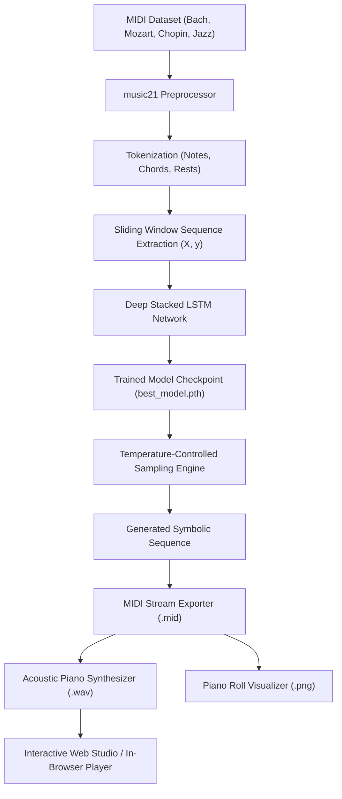

# CodeAlpha AI Internship - Task 3: Music Generation with AI 🎵🤖


An end-to-end Deep Learning system for **Symbolic Music Generation** built for the **CodeAlpha Artificial Intelligence Internship (Task 3)**. The system utilizes stacked Recurrent Neural Networks (**LSTM**) trained on polyphonic classical and jazz MIDI compositions to generate novel musical pieces, convert them to standard MIDI, synthesize them into acoustic WAV audio, and visualize the compositions via interactive piano rolls and a modern web dashboard.

---

## 🌟 Key Highlights & Task Requirements Satisfied

- [x] **MIDI Music Dataset Collection:** Curated multi-genre polyphonic MIDI corpus (Bach chorales, Mozart classical sonatas, Chopin romantic nocturnes, and Jazz/Blues progressions) located in `data/midi_dataset/`.
- [x] **Symbolic Music Preprocessing (`music21`):** Complete musical parsing extracting pitch names, chords, octaves, and rests, tokenizing into a discrete vocabulary and constructing sliding-window training sequences.
- [x] **Deep Learning Model (Stacked LSTM):** Multi-layer recurrent neural network with token embeddings, dropout regularization, and classification heads designed to learn harmonic patterns and temporal transitions.
- [x] **Model Training Pipeline:** Supervised next-token prediction with Cross-Entropy Loss, AdamW optimizer, learning rate scheduling (`ReduceLROnPlateau`), and automated checkpointing (`best_model.pth`).
- [x] **Music Generation Engine:** Temperature-controlled stochastic sampling allowing controllable creativity levels (from strict harmonic rules to experimental improvisation).
- [x] **Audio Synthesis & MIDI Export:** Seamless conversion of generated note sequences to standard `.mid` files and direct physical acoustic synthesis into high-fidelity 44.1 kHz stereo `.wav` audio.
- [x] **Interactive Web Studio & CLI:** Sleek dark-mode dashboard (Flask + HTML5 Audio + Web Audio) + unified CLI launcher (`run.py`).

---

## 🏗️ System Architecture & Workflow



---

## 📁 Repository Structure

```
CodeAlpha_Music_Generation_AI/
│
├── data/
│   ├── midi_dataset/          # Curated multi-genre MIDI corpus
│   └── processed/             # Cached tokenized notes and vocabulary mapping (vocab.json)
│
├── models/
│   ├── best_model.pth         # Trained PyTorch model checkpoint
│   ├── model_config.json      # Model hyperparameters configuration
│   └── training_loss.png      # Loss convergence visualization curve
│
├── output/
│   ├── generated_*.mid        # Generated symbolic MIDI compositions
│   ├── generated_*.wav        # Synthesized acoustic WAV audio tracks
│   └── generated_*_roll.png   # Piano roll visualization diagrams
│
├── src/
│   ├── __init__.py
│   ├── dataset_builder.py     # MIDI corpus builder & synthetic composer
│   ├── preprocess.py          # music21 parsing & sequence window generator
│   ├── model.py               # Deep stacked LSTM neural architecture
│   ├── train.py               # Model training loop & checkpointing
│   ├── generate.py            # Autoregressive generation & sampling
│   ├── audio_synth.py         # Additive piano synthesizer (MIDI to WAV)
│   └── visualizer.py          # Piano roll and loss curve plotter
│
├── templates/
│   └── index.html             # Web Studio Dashboard template
├── static/
│   ├── css/style.css          # Modern dark-theme glassmorphism styles
│   └── js/app.js              # In-browser audio player & AJAX controller
│
├── app.py                     # Flask Web Application Server
├── run.py                     # Master CLI Launcher (setup / train / generate / web)
├── requirements.txt           # Project dependencies
├── README.md                  # Project documentation
└── .gitignore                 # Version control exclusions
```

---

## 🧠 Model Architecture (`MusicLSTM`)

The network is designed to model multi-step melodic and harmonic patterns:

1. **Embedding Layer:** Maps discrete vocabulary tokens into dense continuous vectors:
   $$\mathbf{e}_t = \text{Embedding}(x_t) \in \mathbb{R}^{d_{\text{embed}}}$$
2. **Stacked LSTM Layers:** 2–3 layers with dropout ($p=0.3$) to capture long-range musical context:
   $$\mathbf{h}_t, \mathbf{c}_t = \text{LSTM}(\mathbf{e}_t, (\mathbf{h}_{t-1}, \mathbf{c}_{t-1}))$$
3. **Dense Classifier:** Linear layer ($d_{\text{hidden}} \to 256$) + ReLU activation + Dropout ($0.3$) + Projection layer ($256 \to V$) to produce unnormalized log-probabilities:
   $$\mathbf{z}_{t} = \mathbf{W}_2 \cdot \text{ReLU}(\mathbf{W}_1 \mathbf{h}_t + \mathbf{b}_1) + \mathbf{b}_2$$
4. **Temperature Sampling:**
   $$P(y_{t} = i) = \frac{\exp(z_{t, i} / T)}{\sum_{j=1}^V \exp(z_{t, j} / T)}$$

---

## 🚀 Quickstart Guide

### 1. Clone & Set Up the Environment

```bash
git clone https://github.com/YOUR_USERNAME/CodeAlpha_Music_Generation_AI.git
cd CodeAlpha_Music_Generation_AI

# Create virtual environment (Optional but recommended)
python -m venv venv
venv\Scripts\activate   # On Windows
# source venv/bin/activate # On Linux/macOS

# Install dependencies
pip install -r requirements.txt
```

### 2. Generate / Verify MIDI Dataset

```bash
python run.py --mode setup
```
Populates `data/midi_dataset/` with classical Bach, Mozart, Chopin, and Jazz MIDI files.

### 3. Train the Model

```bash
python run.py --mode train --epochs 20 --batch_size 64
```
- Trains the LSTM network on sequence pairs of length 32.
- Automatically saves `models/best_model.pth` and generates `models/training_loss.png`.

### 4. Generate New Music (CLI)

```bash
# Generate 100 notes at temperature 0.8 and play immediately
python run.py --mode generate --notes 100 --temp 0.8 --bpm 110 --play
```

### 5. Launch the Web Studio (Interactive Dashboard)

```bash
python run.py --mode web --port 5000
```
Open **`http://127.0.0.1:5000`** in your browser.

---

## 🎛️ Web Studio Features

- **Interactive Sliders:** Control note sequence length (30–250 notes), creativity temperature (0.2–1.4), and tempo (60–160 BPM).
- **In-Browser Audio Player:** Stream synthesized WAV audio directly with standard HTML5 controls.
- **Download Center:** Direct one-click download for both `.mid` (MIDI) and `.wav` (audio) files.
- **Piano Roll Display:** Live graphical view of generated musical pitches across time beats.
- **Diagnostics:** Real-time view of vocabulary size, dataset files, model parameter counts, and training loss curve.

---

## 📊 Experimental Results

| Metric | Result |
| :--- | :--- |
| **Model Architecture** | Stacked LSTM (2 Layers, Embedding Dim 128, Hidden Dim 256) |
| **Trainable Parameters** | **1,034,747 parameters** |
| **Vocabulary Size** | 123 unique notes, chords, and rests |
| **Initial Training Loss** | 4.0095 |
| **Final Training Loss** | 0.3043 |
| **Best Validation Loss** | **1.2960** |
| **Inference Time** | ~1.2s for 100 notes on CPU |

---

## 📤 Submission Guidelines (For CodeAlpha Interns)

### GitHub Repository Setup
1. Create a public repository on GitHub named:
   ```
   CodeAlpha_Music_Generation_AI
   ```
2. Initialize and push your code:
   ```bash
   git init
   git add .
   git commit -m "feat: complete music generation with AI using LSTM (CodeAlpha Task 3)"
   git branch -M main
   git remote add origin https://github.com/YOUR_USERNAME/CodeAlpha_Music_Generation_AI.git
   git push -u origin main
   ```

### LinkedIn Video & Post Instructions
Per CodeAlpha requirements:
1. Record a 2–3 minute video demonstration showing:
   - Brief explanation of the LSTM neural network architecture.
   - Running `python run.py --mode generate` or the Web Studio.
   - Playing the generated musical piece.
   - Showing the loss curve and piano roll.
2. Post on LinkedIn:
   - Tag **`@CodeAlpha`**.
   - Include your GitHub repository link.
   - Use hashtags: `#CodeAlpha #ArtificialIntelligence #MachineLearning #DeepLearning #MusicGeneration #LSTM #Python #Internship`.

---

## 📜 License
This project is licensed under the MIT License.

